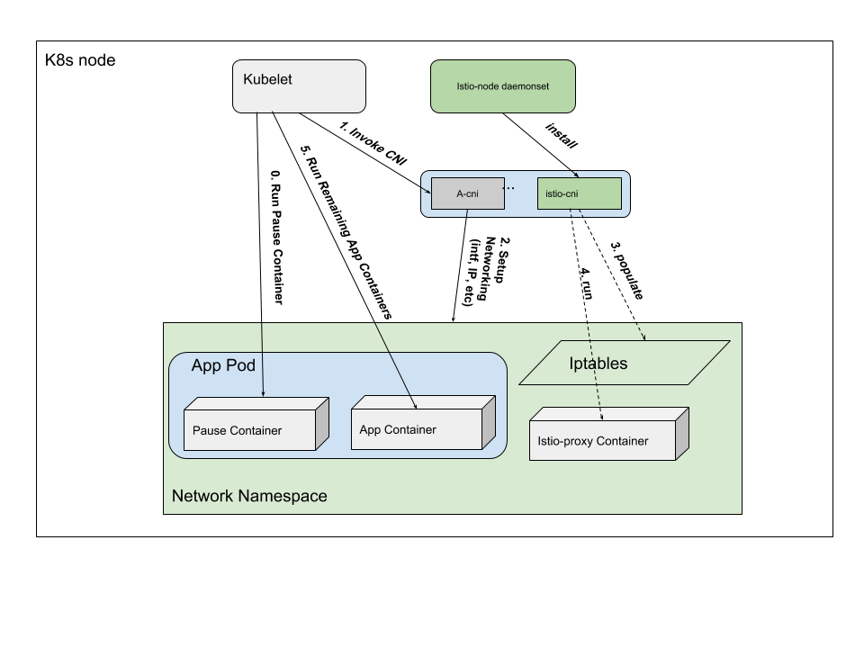

# loosely coupled istio envoy sidecar (WIP/POC)

This work is built on top of istio-cni which this repo is currently forked from.

Currently there are two ways to inject istio envoy sidecar:

1. Automatically by istio-sidecar-injector
1. Manually by istioctl kube-inject

Both methods insert an istio-proxy container spec into the application
manifests. Therefore, the envoy sidecar and the application itself become
tightly coupled in every aspects: lifecycle management, security, to name a
couple of things. This document [Sidecar-less Istio](https://docs.google.com/document/d/1vb9qIKTNnODWo_Uij2BGDrFj6gVygllRq5zrXmniLxc/edit#heading=h.qex63c29z2to)
describes the issues associated with the current sidecar injection mechanisms.

Istio-cni eliminates the need of init containers, while performing the function
of configuring traffic redirection for the application pods. On top of that,
this work injects the envoy sidecar container into the application pod's network
namespace. In addition to invoke istio-iptables.sh to configure iptables in the
application pod's network namespace, it also invokes add-sidecar.sh to add an
envoy sidecar container to the application pod's network namespace.

As a result, the application pod and the envoy sidecar become loosely coupled.
This opens a door to allow issues described in Sidecar-less Istio to be solved.
As it is now, this work is very preliminary just to illustrate the concept and
how it'd work in principle. Later section will discuss potential
design/implementation for a complete implementation.

## usage
### Install
The following are the steps to install this plugin

1. clone this repo

1. Install Istio control-plane (My setup uses PERMISSIVE for MTLS for POC
   purpose)

1. Modify [istio-cni.yaml](deployments/kubernetes/install/manifests/istio-cni.yaml)
   1. set `CNI_CONF_NAME` to the filename for your k8s cluster's CNI config file in `/etc/cni/net.d`
   1. set `cni_bin_dir` to your kubernetes install's CNI bin location (the value of kubelet's `--cni-bin-dir`)
      1. default is `/opt/cni/bin`

1. Install `istio-cni`: `kubectl apply -f deployments/kubernetes/install/manifests/istio-cni.yaml`

1. Get istio.default secret, and decode them into separate files: cert-chain.pem
   key.pem and root-cert.pem following [decoding
   secret](https://kubernetes.io/docs/concepts/configuration/secret/#decoding-a-secret)

1. create a directory /opt/certs on each of the k8s nodes

1. copy the three files into /opt/certs on each of the k8s nodes

### Deploy bookinfo

All that needs to be done is to invoke `kubectl apply -f bookinfo.yaml`

### Validate envoy sidecars are running

On the node(s) where bookinfo pods are running, invoke:

```
sudo docker ps | grep istio-proxy | grep -v k8s
```
to verify that envoy sidecars are running for all the bookinfo pods.

Note down the container id for the productpage istio-proxy sidecar.

Find the productpage pod's IP address, and then call the productpage service:

```
curl <productpage IP>:9080/productpage
```

An html document should be returned and displayed on the screen.

To verify that the productpage istio-proxy sidecar is in the data path:

```
sudo docker logs <productpage istio-proxy container_id>
```

You should see that the bookinfo services were called.

### Cleanup

After undeploying bookinfo, currently you have to run
`/opt/cni/bin/cleanup-istio-proxy.sh` to remove all the sidecar containers in
each of the k8s nodes. 

### Hosted Kubernetes

Not all hosted Kubernetes clusters are created with the kubelet configured to use the CNI plugin so
compatibility with this `istio-cni` solution is not ubiquitous.  The `istio-cni` plugin is expected
to work with any hosted kubernetes leveraging CNI plugins.  The below table indicates the known CNI status
of hosted Kubernetes environments and whether `istio-cni` has been trialed in the cluster type.

| Hosted Cluster Type | Uses CNI | istio-cni tested? |
|---------------------|----------|-------------------|
| GKE 1.9.7-gke.6 default | N | N |
| GKE 1.9.7-gke.6 w/ [network-policy](https://cloud.google.com/kubernetes-engine/docs/how-to/network-policy) | Y | Y |
| IKS (IBM cloud) | Y | Y (on k8s 1.10) |
| EKS (AWS) | Y | N |
| AKS (Azure) | Y | N |

#### GKE Setup (not verified)

1. Enable [network-policy](https://cloud.google.com/kubernetes-engine/docs/how-to/network-policy) in your cluster.  NOTE: for existing clusters this redeploys the nodes.

1. Make sure your kubectl user (service-account) has a ClusterRoleBinding to the `cluster-admin` role.  This is also a typical pre-requisite for installing Istio on GKE.
   1. `kubectl create clusterrolebinding cni-cluster-admin-binding --clusterrole=cluster-admin --user=tiswanso@gmail.com`
      1. User `tiswanso@gmail.com` is an admin user associated with the gcloud GKE cluster

1. Install `istio-cni`: `kubectl apply -f deployments/kubernetes/install/manifests/istio-cni_gke.yaml`

1. Install Istio

1. Get istio.default secret, and decode them into separate files: cert-chain.pem
   key.pem and root-cert.pem following [decoding
   secret](https://kubernetes.io/docs/concepts/configuration/secret/#decoding-a-secret)

1. create a directory /opt/certs on each of the k8s nodes

1. copy the three files into /opt/certs on each of the k8s nodes

### IKS Setup

No special set up is required for IKS, as it is currently use the default `cni-conf-dir` and `cni-bin-dir`.

## Build

For linux targets:

```
$ GOOS=linux make build
$ HUB=docker.io/baodongli TAG=dev GOOS=linux make docker.push
```

**NOTE:** Set HUB and TAG per your docker registry. But you need to modify
`deployments/kubernetes/install/manifests/istio-cni.yaml` to use your
own image.

## How it works


Briefly:
1. Kubelet creates and runs the Pause container
1. Kubelet invokes the cni plugins to setup networking. 
1. istio-cni plugin is called as the last cni plugin. It installs iptables into
   the pod's networking namespace.
1. It then calls another script add-sidecar.sh which creates a docker container
   that runs istio proxy in the same network namespace as the pod's
1. kubelet receives responses from cni, and goes forward with the remaining
   tasks to bring up the pod. This includes any containers running in the pod.

As can be seen, the flow is quite fit with the istio init flow.

For envoy to be able to connect to Pilot, the istio.default secret is decoded
into certificate files, and copied over to /opt/certs in each of the k8s nodes.
The istio-proxy container is then started with a bind mount to /opt/certs. Note
that this is just for quick POC.

## Design/Implementation
A complete design and implementation of loosely coupled istio envoy sidecar
requires more than the above basic flow. It can be imagined that each node runs
a sidecar manager that is repsonsible for the sidecar lifecycle management. This
sidecar manager work with the istio-cni and other necessary components (such
as sidecarctl, e.g.) to:

1. Start/stop istio envoy sidecars

1. Mount secrets

1. Upgrade sidecars without impacting application traffic with enovy hot restart

1. Maintain clear security separation between application pods and sidecars

1. Configure traffic redirection to the sidecars.

1. Potentially monitor dynamic ports and traffic redirection 

In the case of per-pod sidecar, the lifecycle of a pod's sidecar remains
concurrent with the pod itself. But it allows the sidecar to be
upgraded/downgraded without impacting the application pod with enchanced
security. In addition, with the sidecar taking out of the application pod, the
sidecar manager can be designed to support shared sidecars. A shared sidecar's
lifecycle is independent from that of the application pods which it's proxied
for.

From high level for the per-pod sidecar, it's like two pods (the application pod
and the sidecar pod) running side-by-side in the same network namespace. From
that sense, it may be possible to generalize it for k8s sidecar management and
have it incorporated into the k8s API.

On the other hand, this can be specifically designed for istio eonvy. And the
sidecar manager can be a k8s controller running as a daemonset to perform the
above functionality.
